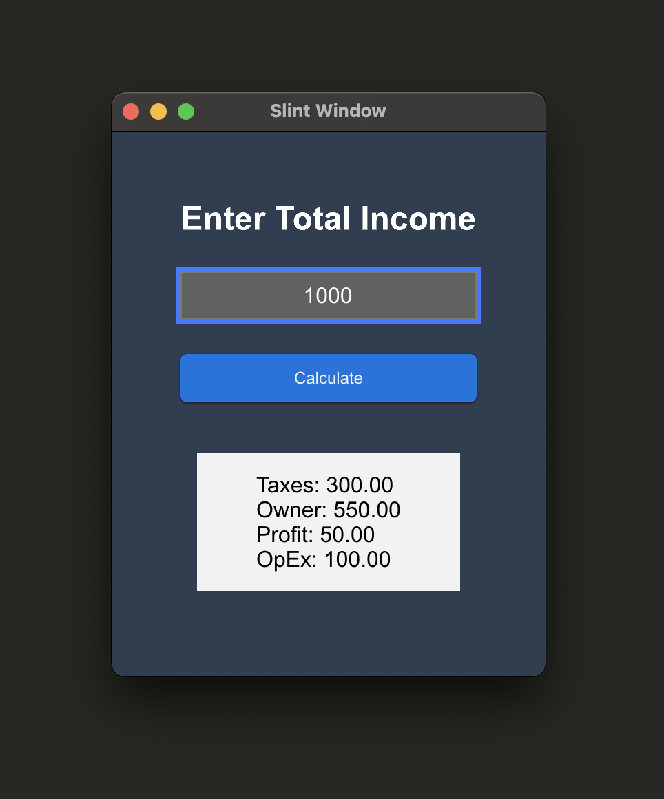

# Income Divider App

The Income Divider App is a simple Rust application designed to calculate and display the distribution of income among various categories based on predefined percentages.



## Overview

The application takes a total income value and divides it according to predetermined percentage allocations. It specifically divides the income into the following categories:
- Taxes
- Owner's Share
- Profit
- Operational Expenses (OpEx)

The predefined percentages used for distribution are as follows:
- Taxes: 30%
- Owner's Share: 55%
- Profit: 5%
- Operational Expenses (OpEx): 10%

## Usage

1. Input the total income value.
2. The application calculates the income distribution based on the provided value and the predefined percentages.
3. The calculated amounts for Taxes, Owner's Share, Profit, and OpEx are displayed.

## How to Run

To run the application, follow these steps:
1. Ensure Rust is installed on your system.
2. Clone the repository.
3. Open a terminal window and navigate to the project directory.
4. Run `cargo run` to execute the application.

## Creating an Optimized Release Version

To create an optimized release version, use the following commands:

1. Build the optimized release version:

```
cargo build --release
```

## Building the App

To create an app build, install the `cargo-bundle` crate:

1. Install `cargo-bundle`:

```
cargo install cargo-bundle
```

2. Add the `[package.metadata.bundle]` in the Cargo.toml file with the name and identifier.
Add a description to the `[package]`.

3. Build command for app version:

```
cargo bundle --release
```